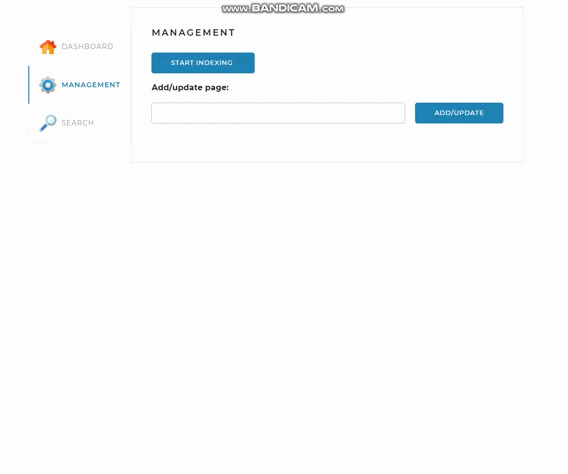

# 🔎 Search Engine

## 📖 Описание проекта
Итоговый проект курса "Java-разработчик с нуля" от Skillbox.

Задача: реализовать поисковый движок по сайту — приложение, которое позволяет индексировать страницы 
и осуществлять по ним быстрый поиск.

Поисковый движок должен представляет из себя Spring-приложение 
(JAR-файл, запускаемый на любом сервере или компьютере), работающее с 
локально установленной базой данных MySQL, имеющее простой 
веб-интерфейс и API, через который им можно управлять и 
получать результаты поисковой выдачи по запросу. 

Search Engine — это учебное поисковое приложение на базе **Spring Boot** и **MySQL**, которое реализует базовый функционал поисковых систем (аналогично Google или Яндекс, но в миниатюре).

Приложение позволяет:
- Индексировать заранее заданные сайты (структура и список задаются в `application.yaml`).
- Хранить страницы, выделенные **леммы** (основные формы слов) и связи «лемма–страница» в базе данных.
- Выполнять полнотекстовый поиск по одному сайту или сразу по всем.
- Возвращать результаты поиска с указанием:
    - ссылки на страницу,
    - названия сайта и страницы,
    - сниппета (фрагмента текста с подсвеченными совпадениями),
    - уровня релевантности.
- Просматривать статистику по индексированным сайтам:
    - статус (в процессе, завершено, ошибка),
    - количество страниц,
    - количество лемм,
    - время последнего обновления.

Таким образом, проект представляет собой **мини-поисковый движок**, ограниченный списком сайтов, заданных в конфигурации.

## 🛠️ Стек технологий
- **Java 17+**
- **Spring Boot** (Web, Data JPA)
- **Hibernate**
- **MySQL 8**
- **Maven**
- **Lombok**
- **Slf4j** (логирование)

---

## 🚀 Локальный запуск проекта

### 1. Установите зависимости

- **Java 17+**  
  Скачать: [Oracle JDK](https://www.oracle.com/java/technologies/javase/jdk17-archive-downloads.html) или [OpenJDK](https://adoptium.net/temurin/releases/)

- **Maven 3.6+**  
  Скачать: [Apache Maven](https://maven.apache.org/download.cgi)

- **MySQL 8.x**  
  Скачать: [MySQL Community Server](https://dev.mysql.com/downloads/mysql/)


- **Java 17+**
- **Maven 3.6+**
- **MySQL 8.x**

Проверьте версии командой:
```bash
java -version
mvn -version
mysql --version
```

### 2. Клонируйте репозиторий проекта
```bash
   git clone https://github.com/AlkatrasMaster/search-engine.git
   cd search-engine
```

### 3. Создайте базу данных MySQL

Подключитесь к MySQL:

mysql -u root -p

В консоли MySQL выполните:

CREATE DATABASE search_engine CHARACTER SET utf8mb4 COLLATE utf8mb4_unicode_ci;

### 4. Настройте подключение к БД

Откройте файл src/main/resources/application.yaml и укажите свои параметры подключения:

```bash
spring:
datasource:
url: jdbc:mysql://localhost:3306/search_engine?useSSL=false&requireSSL=false&allowPublicKeyRetrieval=true
username: root
password: ваш_пароль
```

### 5. Укажите сайты для индексации

В том же файле application.yaml добавьте сайты, которые будут индексироваться:

```bash
indexing-settings:
sites:
- url: https://lenta.ru
name: Лента.ру
- url: https://skillbox.ru/
name: Skillbox
- url: https://www.playback.ru
name: PlayBack.Ru
```

### 6. Соберите проект

Выполните команду:

```bash
mvn clean install
```

### 7. Запустите приложение

Есть два способа:

1. Через Maven (рекомендуется во время разработки):
```bash
mvn spring-boot:run
```

2. Через готовый jar:
```bash
java -jar target/searchengine-1.0.jar
```

### 8. Проверьте работу приложения

После запуска сервис будет доступен по адресу:
👉 http://localhost:8080

## 🔧Основные API эндпоинты

GET /startIndexing — запустить индексацию всех сайтов



GET /stopIndexing — остановить индексацию

POST /indexPage?url={pageUrl} — проиндексировать отдельную страницу

GET /search?query={слово}&site={url} — выполнить поиск

GET /statistics — получить статистику